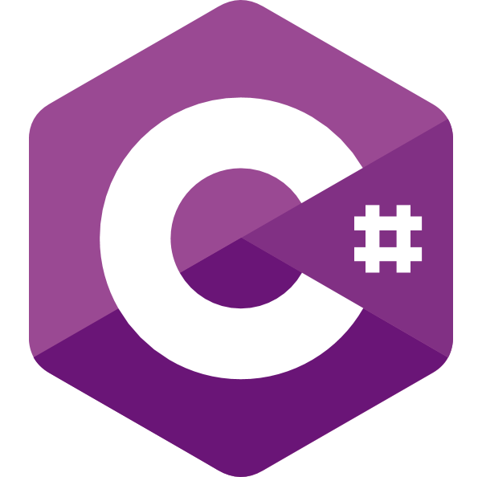
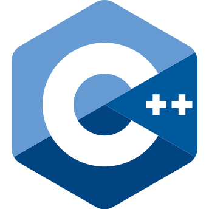
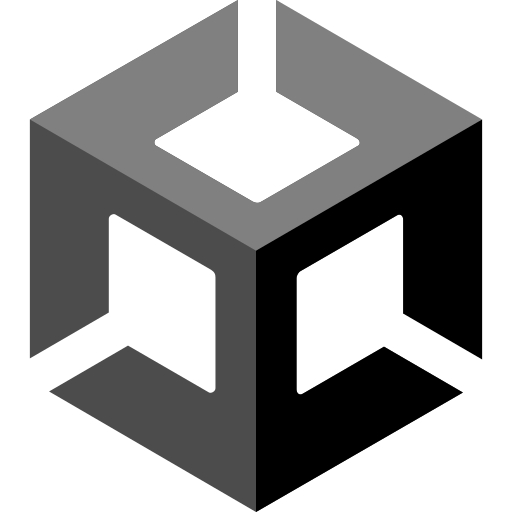

<h1 align="center">Hi, I'm Danon5—an aspiring programmer chasing his dreams.</h1>

I find that there is too much to learn for one lifetime! Oh how I wish we had multiple.

<h2 align="left">Favorite Languages</h2>
<lo>
  
<li><b> C#</b></li>

  
<li><b> C++</b></li>

  
<li><b> Java</b></li>

</lo>

<h2 align="left">Favorite Tools</h2>
<lo>
  
<li><b> Unity</b></li>

  
<li><b> Rider</b></li>

  
<li><b> Photoshop</b></li>

  
<li><b> Aseprite</b></li>

  
<li><b> Blender</b></li>

  
<li><b> Eclipse</b></li>

  
<li><b> Windows</b></li>

  
<li><b> FL Studio</b></li>

</lo>

<h2 align"left">Statistics</h2>

<h2 align="left">Contact Info</h2>

<b> danonfive@gmail.com</b>

<b> Danon5#9329</b>

